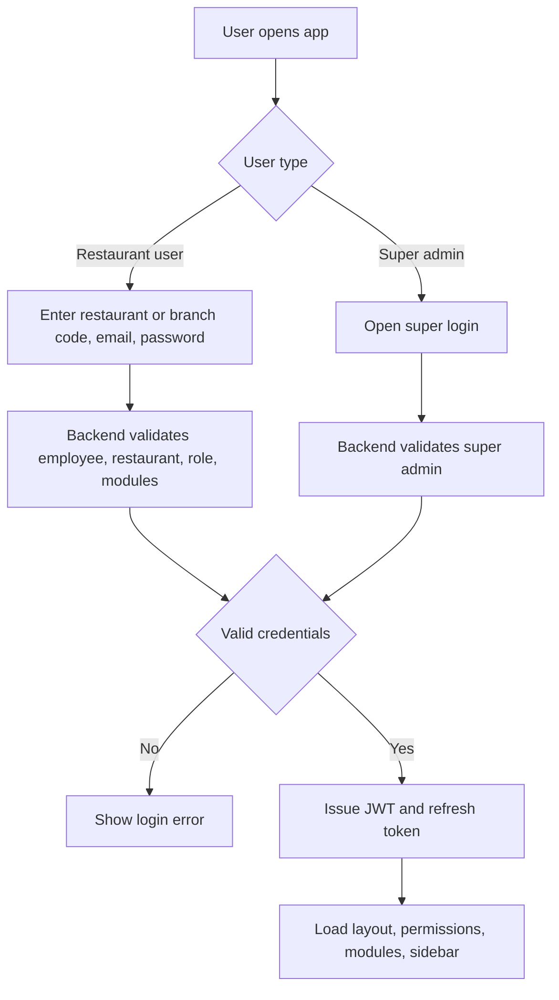
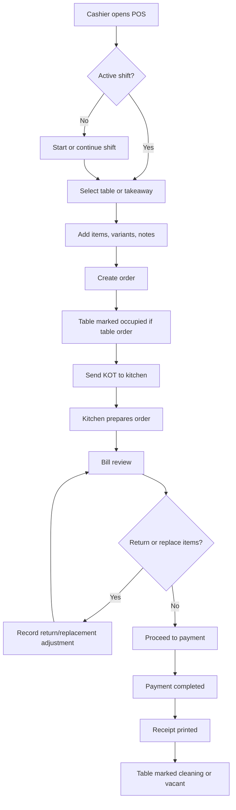
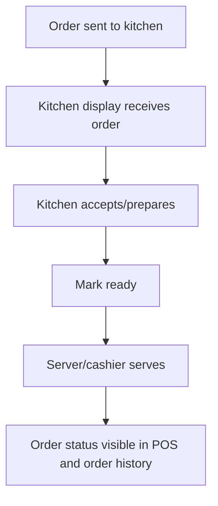
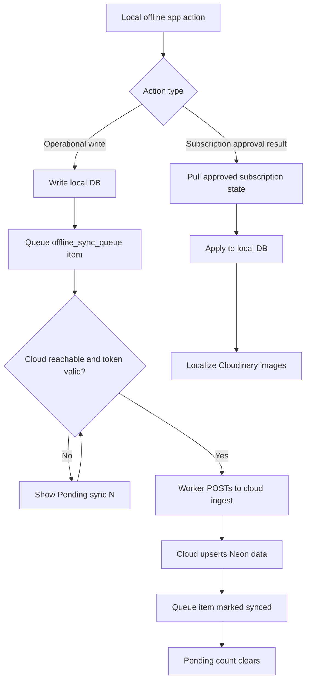
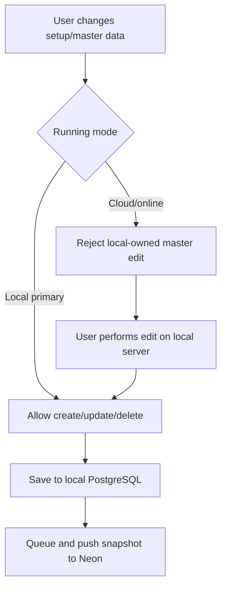
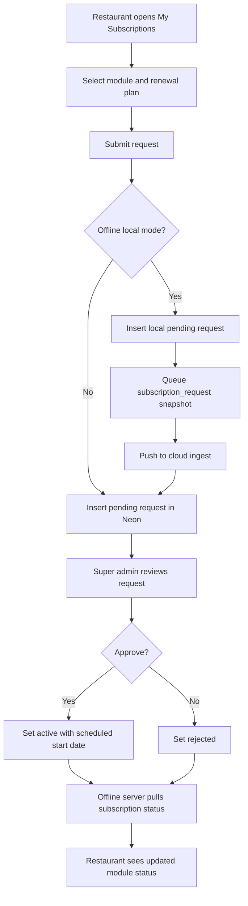
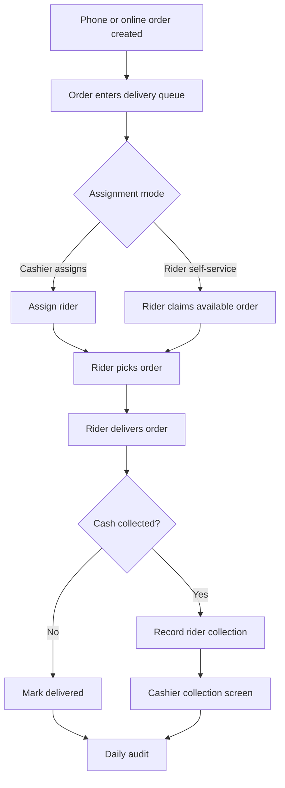
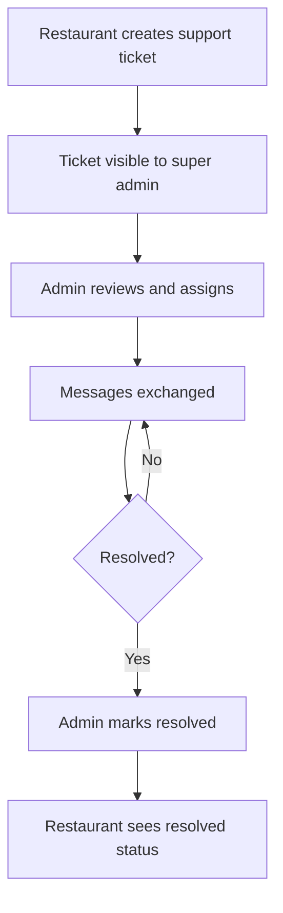

# RestaurantOS Flow Diagrams

Version: 1.0  
Date: 2026-05-14

## 1. Login and Access Flow

## 2. POS Table Order Flow

## 3. Kitchen Workflow

## 4. Offline Sync Flow

## 5. Master Data Governance Flow

## 6. Subscription Renewal Flow

## 7. Delivery and Rider Flow

## 8. Support Ticket Flow

