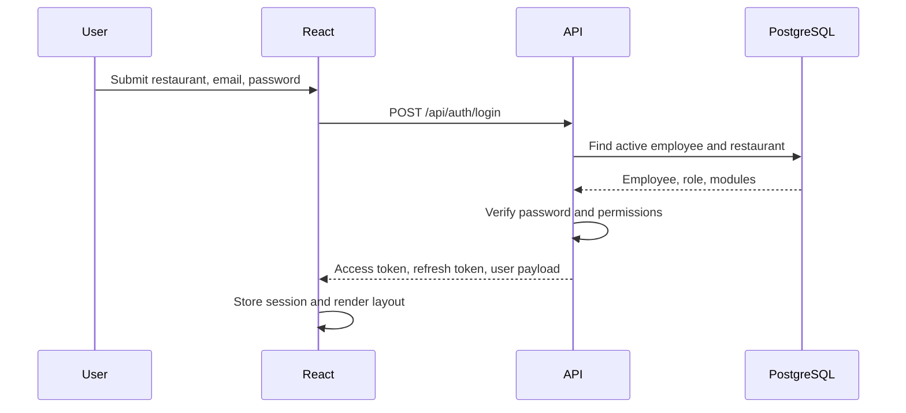
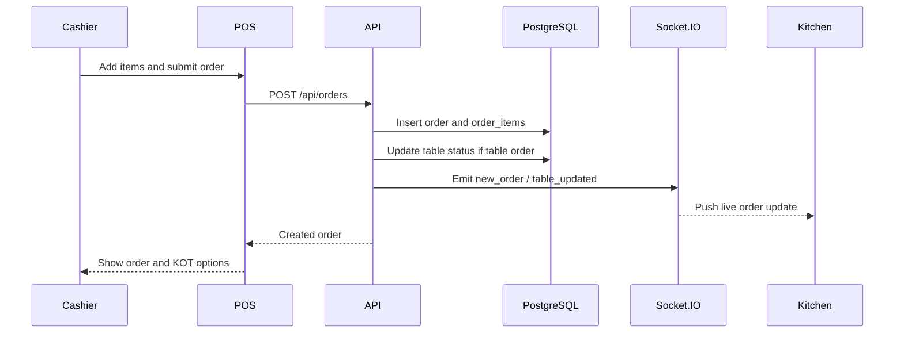
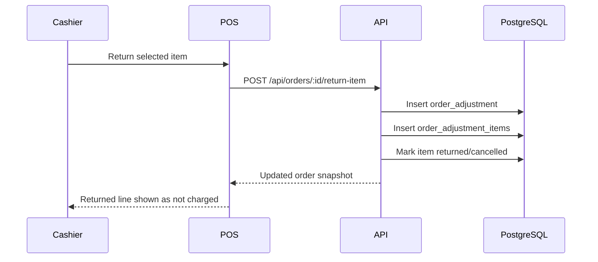
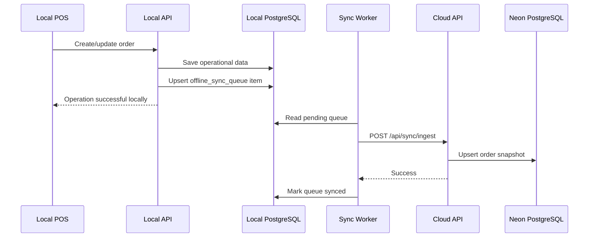
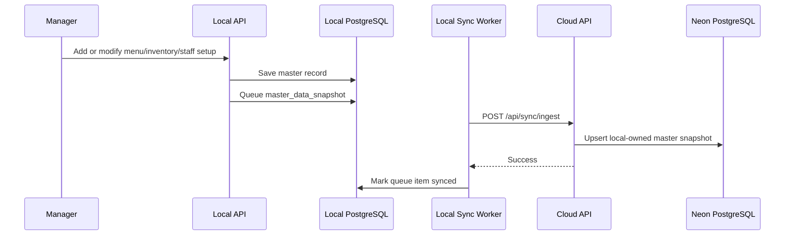
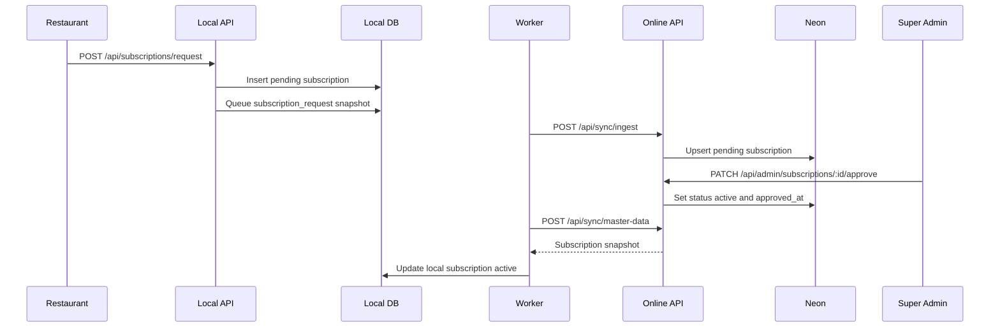
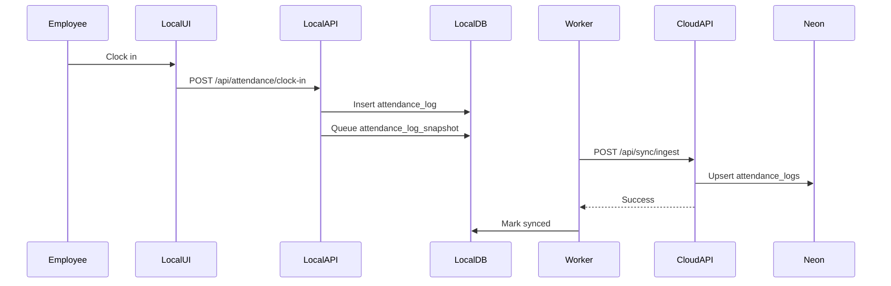
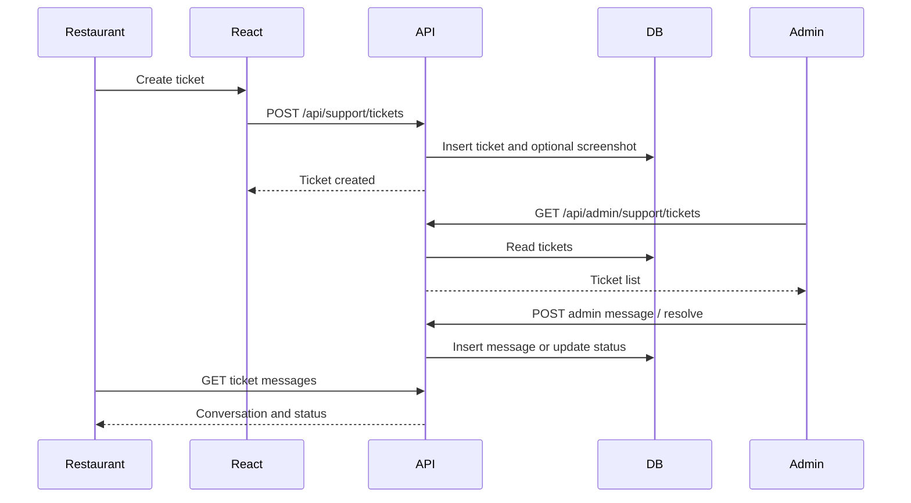

# RestaurantOS Sequence Diagrams

Version: 1.0  
Date: 2026-05-14

## 1. Restaurant Login

## 2. POS Order Creation

## 3. Order Return

## 4. Offline Order Sync Push

## 5. Local Master Data Push

## 6. Subscription Request and Approval

## 7. Attendance Clock-In Sync

## 8. Support Ticket Conversation

