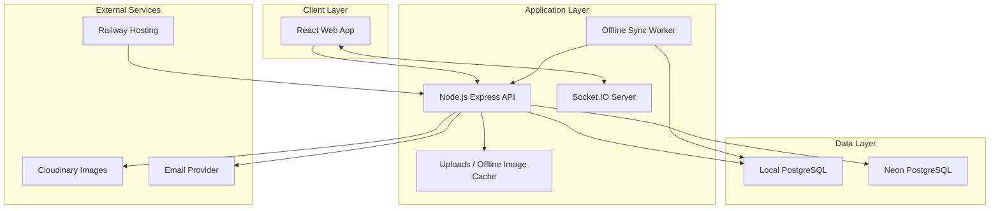
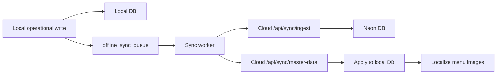

# RestaurantOS System Architecture

Version: 1.0  
Date: 2026-05-14

## 1. Executive Summary

RestaurantOS is a multi-tenant SaaS restaurant management platform built with React, Node.js, Express, Socket.IO, and PostgreSQL. It supports cloud mode through Neon PostgreSQL and local offline mode through a Dockerized local server and local PostgreSQL database. Offline mode uses a sync queue for operational writes and cloud pull for master data.

## 2. Architecture Goals

- Support restaurant operations even when internet connectivity is unavailable.
- Keep master data controlled centrally from cloud to avoid conflicts.
- Sync operational activity from local stores to cloud as soon as connectivity returns.
- Keep tenant data separated by `restaurant_id`.
- Provide role and module-based access control.
- Support SaaS administration, subscriptions, module pricing, groups, and support.

## 3. High-Level Architecture

## 4. Deployment Modes

### 4.1 Cloud / Online Mode

| Aspect | Description |
|---|---|
| App | Online backend and frontend. |
| Database | Neon PostgreSQL. |
| Mode | `DEPLOYMENT_MODE=cloud`, `DB_MODE=neon`. |
| Use Case | Main SaaS operation, admin approval, master data management. |

### 4.2 Local Offline Mode

| Aspect | Description |
|---|---|
| App | Local Docker app at `http://localhost:5051`. |
| Database | Local Docker PostgreSQL. |
| Mode | `DEPLOYMENT_MODE=local_offline`, `DB_MODE=local`. |
| Use Case | POS/store operations without internet. |
| Sync | Push operational data to cloud and pull master data from cloud. |

### 4.3 Local Online Test Mode

| Aspect | Description |
|---|---|
| App | Local Docker online app at `http://localhost:5052`. |
| Database | Neon PostgreSQL. |
| Mode | `DEPLOYMENT_MODE=cloud`, `DB_MODE=neon`. |
| Use Case | Test cloud behavior without Railway deployment. |

## 5. Core Components

| Component | Responsibility |
|---|---|
| React frontend | User interface, routing, session handling, module navigation, API calls. |
| Express API | Business logic, validation, authentication, module permissions, persistence. |
| Socket.IO | Live updates for orders, kitchen, tables, and operational events. |
| PostgreSQL | Primary relational data store for tenants, orders, staff, inventory, finance, and sync. |
| Offline sync worker | Pushes local operational queue and pulls cloud master data. |
| Cloudinary | Stores remote menu and restaurant images in cloud mode. |
| Offline image cache | Downloads Cloudinary menu images and rewrites local URLs to local uploads path. |

## 6. Module Architecture

| Module | Main Screens | Main Backend Area |
|---|---|---|
| Authentication | Login, super login, reset password | `authController.js` |
| Dashboard | Dashboard | orders/dashboard stats |
| POS | POS, order history, kitchen | `ordersController.js`, `combinedControllers.js` |
| Tables | Tables, reservations | `combinedControllers.js` |
| Kitchen/Menu | Inventory, recipes, menu management | `inventoryController.js`, `combinedControllers.js` |
| Staff | Employees, attendance, shifts | `attendanceController.js`, `combinedControllers.js` |
| Delivery | Phone orders, rider dashboard, collections, audit | `deliveryController.js`, `riderController.js` |
| Finance | Ledger, GL setup, GL reports | `combinedControllers.js` |
| Reports | Sales, menu, employee, refunds, shift sales | `ordersController.js` |
| Subscriptions | My subscriptions, pricing, approvals | `subscriptionController.js` |
| Support | Restaurant and admin support tickets | `supportController.js` |
| Sync | Offline queue, master pull, ingest | `syncController.js`, `offlineSync.js`, `masterDataSync.js` |

## 7. Data Ownership Model

### Cloud-Owned Master Data

The following should be added or modified from cloud/online mode to avoid conflicts:

- Restaurant settings and logo.
- Dining table setup.
- Employees and roles.
- Menu categories, items, variants, add-ons, and images.
- Inventory item definitions.
- Recipes and recipe ingredients.
- Discount presets.
- Subscription approvals and module pricing.

### Local Operational Data

The following can be created or updated locally and synced to cloud:

- Orders and order items.
- Order returns, replacements, and adjustments.
- Shift sessions.
- Attendance logs.
- Dining table operational status.
- Subscription renewal requests.
- Inventory stock movements.

## 8. Offline Sync Architecture

### Queue Behavior

- Queue records include entity type, entity id, operation, endpoint, payload, idempotency key, attempts, status, and error.
- Stable idempotency keys prevent duplicate pending records for the same logical operation.
- Status values include pending, syncing, synced, failed, and conflict.
- The UI displays pending sync count from queue status.

### Sync Payloads

| Payload | Direction | Purpose |
|---|---|---|
| `order_snapshot` | Local to cloud | Orders, items, returns, adjustments, table status. |
| `shift_session_snapshot` | Local to cloud | Shift open/continue/close events. |
| `attendance_log_snapshot` | Local to cloud | Clock-in, clock-out, manual logs, voids. |
| `dining_table_status_snapshot` | Local to cloud | Operational table status updates. |
| `subscription_request_snapshot` | Local to cloud | Offline subscription renewal request. |
| `master_data_snapshot` | Cloud to local | Cloud-owned setup/master data. |

## 9. Security Architecture

| Control | Description |
|---|---|
| JWT authentication | Authenticated API access for restaurant users and super admins. |
| Refresh tokens | Session renewal and logout invalidation support. |
| Role permissions | Fine-grained access to modules/actions. |
| Module subscriptions | Feature access governed by active subscriptions. |
| Sync token | Protected offline sync ingest and master data pull. |
| Rate limiting | Basic auth/API rate limits in Express middleware. |
| Tenant isolation | Most business data scoped by `restaurant_id`. |

## 10. Key Integrations

| Integration | Purpose |
|---|---|
| Neon PostgreSQL | Cloud data store. |
| Local PostgreSQL | Offline data store. |
| Cloudinary | Cloud image storage. |
| SMTP/Email provider | Password reset and subscription notifications. |
| Railway | Production hosting target when active. |

## 11. Operational Monitoring

Primary checks:

- `/api/health`
- `/api/db-info`
- `/api/sync/status`
- Docker container status.
- Backend logs for database, sync, and worker errors.

Common sync symptoms:

- `Pending sync N`: queue has unsynced local items.
- `Sync issues N`: failed or conflict queue items exist.
- `Offline - local mode`: local app running without cloud reachability.
- `Local mode online`: local app running with cloud reachable.

## 12. Deployment and Release Notes

- Build frontend with `npm run build --prefix frontend`.
- Rebuild local Docker apps with:
  - `docker compose -f docker-compose.local.yml up -d --build --force-recreate`
  - `docker compose -f docker-compose.online.yml up -d --build --force-recreate`
- Do not commit `backend/.env`, `frontend/.env`, uploaded images, build artifacts, or local runtime caches unless explicitly required.
- Do not deploy to Railway until the user confirms the Railway subscription is renewed.

